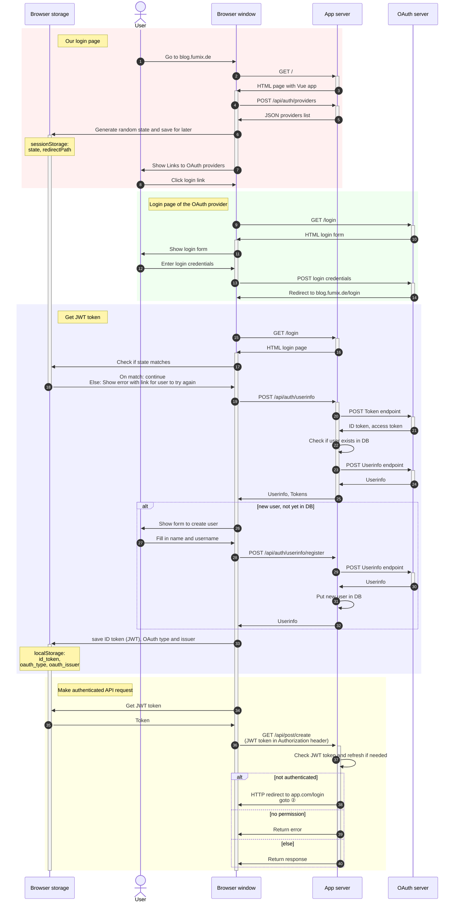

> [Docs](../README.md) › **OAuth**

# OAuth

Using the different OAuth providers requires a bit of preparations, usually to create an OAuth application for that provider.

The login portal should be the easiest option for local development. It allows you to use fake user accounts, but is only available with `NODE_ENV=development`.

* [Login portal](./Portal.md)
* [Google](./Google.md)
* [GitLab](./Gitlab.md)

## Login flow

